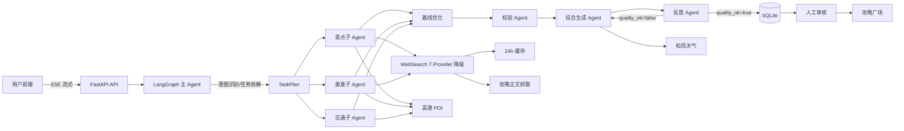

# 星旅 Agent 系统架构

## 总体架构

## 数据链路

1. 用户输入进入主 Agent，先做 LLM 意图识别和参数提取。
2. 按 changed_fields 生成最小子任务集，景点/美食/交通子 Agent 并行执行。
3. 子 Agent 调用搜索、高德 POI、攻略正文抓取，结果带来源。
4. 路线优化、校验、综合生成，再由反思 Agent 检查并回流重试。
5. 最终行程写入 SQLite，用户可直接发布；攻略进入人工审核。
6. 每次生成写入 agent_runs，记录 token、耗时、状态，用于指标和成本统计。

## 可靠性设计

- 搜索 Provider 自动降级：Tavily -> SerpAPI -> Bing -> Google -> Serper -> Brave -> 多平台爬取 -> 内置语料
- 子 Agent 失败不中断整体生成
- 预算重算后强制执行 within_budget
- 攻略标题过滤 + LLM 提取真实店名
- 会话并发写入使用 INSERT OR IGNORE，避免主键冲突
- 反思重试最多 2 次，只修正问题项
